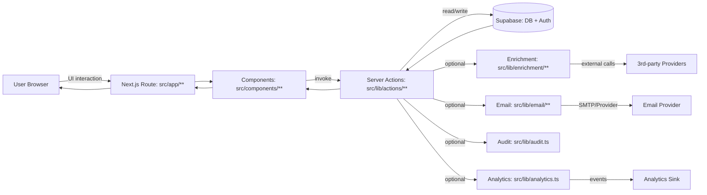

# Data Flow

This document explains how data moves through the application—from user interactions in the UI, through Next.js routes and Server Actions, into Supabase and external integrations—plus where authorization, validation, auditing, and analytics occur.

It’s intended as a developer-oriented map of “what calls what” and “where a piece of data is created/validated/persisted/enriched”.

## Mental Model: Three Planes

The codebase is easiest to reason about as three planes that collaborate per request:

1. **Presentation plane (UI + Routes)**  
   Next.js route segments in `src/app/**` and React components in `src/components/**` collect user input and render state.

2. **Application/service plane (use-cases)**  
   Server Actions in `src/lib/actions/**` and Auth API routes in `src/app/api/auth/**` implement business flows:
   - validate inputs
   - enforce permissions
   - read/write Supabase tables
   - call enrichment/readiness logic
   - emit side effects (audit/email/analytics)

3. **Data & integration plane (systems of record + providers)**  
   Supabase (Auth + Postgres + RPC) is the system of record. External providers (enrichment, email, analytics) are best-effort side effects.

---

## High-Level End-to-End Flow

The dominant request/response path is **UI → Server Action → Supabase (+ optional integrations) → UI**.

### What this implies in practice

- **Components are thin**: they gather input and call actions; the action owns correctness and persistence.
- **Actions are the application boundary**: most “business logic” should live in, or be orchestrated by, `src/lib/actions/**`.
- **Supabase is authoritative**: any data that must survive page refresh or be shared across users must be persisted there.
- **Integrations are side effects**: enrichment/email/analytics should not compromise core flows when transiently failing.

---

## Core Entry Points (Where Data Enters)

### 1) Browser/UI

- **Routes**: `src/app/**` (e.g., onboarding, dashboard, projects)
- **Components**: `src/components/**` (forms, wizards, dashboards)

Data enters from:
- form submissions
- stepper/wizard transitions
- button clicks that trigger server actions

Notable onboarding UI entry:
- `src/components/onboarding/OnboardingWizard.tsx` (imported by several files; central to onboarding UX)

### 2) Server Actions (primary use-case interface)

Actions live in:

- `src/lib/actions/auth.ts`
- `src/lib/actions/onboarding.ts`
- `src/lib/actions/organizations.ts`
- `src/lib/actions/projects.ts`
- `src/lib/actions/members.ts`
- `src/lib/actions/invites.ts`
- `src/lib/actions/navigation.ts`
- `src/lib/actions/advisor.ts`
- `src/lib/actions/readiness.ts`

**Rule of thumb**: If a UI operation creates/updates domain state, it should go through an action.

Actions typically:
- obtain a Supabase server client (`src/lib/supabase/server.ts`)
- validate and normalize input
- perform permission checks (often via navigation/context helpers)
- persist changes to Supabase
- optionally trigger enrichment/readiness and cross-cutting events

### 3) API Routes (auth lifecycle + specialized flows)

Auth and account recovery is handled by Next.js API routes:

- `src/app/api/auth/login`
- `src/app/api/auth/signup`
- `src/app/api/auth/logout`
- `src/app/api/auth/verify-mfa`
- `src/app/api/auth/forgot-password`
- `src/app/api/auth/reset-password`
- `src/app/api/auth/resend-otp`
- `src/app/auth/callback` (post-auth callback handling)

These routes coordinate with Supabase Auth and often produce/consume session cookies.

### 4) Middleware (request gating and context enforcement)

- `src/middleware.ts`
- `src/lib/supabase/middleware.ts` (helpers like route classification)

Middleware is the first gate for:
- protected route checks
- auth route handling
- session expectations

---

## Where Data Goes (Persistence + Outputs)

### System of record: Supabase (Auth + Postgres)

- **Clients**:
  - `createClient` in `src/lib/supabase/server.ts` (session-aware)
  - `createAdminClient` in `src/lib/supabase/server.ts` (service role operations)

- **DB Types**:
  - `src/types/database.ts` (generated schema types)
  - Domain types also exist in `src/types/**` (onboarding, projects, navigation, etc.)

**Data exits** the action layer primarily through:
- inserts/updates to Supabase tables
- auth session updates (Supabase Auth)
- derived data persisted as structured JSON/columns depending on schema

### Rendered output: UI

After actions complete, Next.js components re-render by:
- fetching updated state server-side (Server Components)
- updating client state (Client Components)
- navigating based on updated onboarding/progress/permissions

---

## Cross-Cutting Concerns: Validation, Authorization, Audit, Analytics

### Validation

Validation is distributed by concern:

- Email and format validation: `src/lib/validation/**` (e.g., `src/lib/validation/email.ts`)
- Taxonomy validation/mapping: `src/lib/taxonomy/**` (e.g., `src/lib/taxonomy/maics.ts`)
- Domain/type-level helpers: `src/types/**` (e.g., `isValidCodename` in `src/types/projects.ts`)

**Convention**: UI should do lightweight validation for UX; server actions perform authoritative validation.

### Authorization and navigation context

Navigation and permission checks are centralized around:

- Types: `src/types/navigation.ts` (e.g., `CalculatedPermissions`, `RoutePermission`, `NavigationContext`)
- Actions: `src/lib/actions/navigation.ts` (active org, access checks like admin access)

**Goal**: enforce access in one place and keep UI logic declarative (“render if allowed”).

### Audit logging

- `src/lib/audit.ts` provides `logAuditEvent` and an `AuditAction` alignment with DB types.

Actions that mutate important business state should log audit events, including:
- membership changes
- onboarding approvals / verification transitions
- readiness field edits (see `auditField` in `src/lib/actions/readiness.ts`)
- project status transitions (e.g., `changeProjectStatus` in `src/lib/actions/projects.ts`)

### Analytics tracking

- `src/lib/analytics.ts` includes event helpers such as:
  - `trackSignupStarted`
  - `trackSignupCompleted`
  - `trackOnboardingStepCompleted`
  - `trackOnboardingCompleted`

Analytics is **non-blocking**: failure to emit should not fail the business operation.

---

## Key Domain Data Flows

### A) Authentication & Session Flow

**Typical path**:
1. User hits `/login` or `/signup` (`src/app/**`)
2. UI calls an auth API route in `src/app/api/auth/**`
3. API route interacts with Supabase Auth
4. Session cookies are set/updated
5. `src/middleware.ts` enforces access on subsequent requests

Related modules:
- MFA: `src/lib/auth/mfa.ts`
- Rate limiting: `src/lib/auth/rate-limit.ts` (e.g., `checkRateLimit`)
- Device/country checks: `src/lib/auth/device.ts` (e.g., `checkCountryChange`)

**Developer note**: Keep auth state changes inside API routes (or dedicated auth actions if present) to avoid inconsistent session/cookie behavior.

---

### B) Onboarding Flow (Wizard → Persisted Steps → Confirmation)

**Entry**: Onboarding UI in `src/components/onboarding/**` and routes in `src/app/onboarding/**` (including `src/app/onboarding/[step]`).

**Orchestration**: `src/lib/actions/onboarding.ts`

Common characteristics:
- step-based progression (`OnboardingStep` in `src/types/database.ts`)
- server-side computation of next/previous steps:
  - `getNextStep` / `getPreviousStep` in `src/types/onboarding.ts`
- progress calculation:
  - `calculateProgress` in `src/types/onboarding.ts`

Enrichment often supports onboarding by pre-filling:
- company data (CNPJ)
- address (CEP)
- website-derived info (logo, etc.)

UI often includes a confirmation stage (e.g., `src/components/onboarding/DataConfirmation.tsx`) to let users correct enrichment results.

**Key output**: persisted onboarding data/progress in Supabase, so state survives refresh and can be reviewed/administered.

---

### C) Organization & Membership Flow (Invites → Acceptance → Roles)

Organizations and membership are handled through actions:

- `src/lib/actions/organizations.ts` (org lifecycle)
- `src/lib/actions/members.ts` (membership lifecycle)
- `src/lib/actions/invites.ts` (invites)

Representative exported operations include:
- `acceptInvite` (`src/lib/actions/invites.ts`)
- `cancelInvite` (`src/lib/actions/invites.ts`)
- `checkSlugAvailability` (`src/lib/actions/organizations.ts`)

Email side-effect:
- `src/lib/email/send-invite.ts`
- `src/lib/email/templates/invite.ts`

**Recommended sequencing for reliability**:
1. Persist invite/token to DB
2. Attempt email send
3. If email fails, expose a “resend invite” path (DB remains source of truth)

---

### D) Projects Flow (Create/Update → Readiness → Status)

Projects are orchestrated by:
- `src/lib/actions/projects.ts`

Types live in:
- `src/types/projects.ts` (inputs, metadata, readiness structures)

Readiness is computed by:
- Scoring utilities: `src/lib/readiness/score.ts` (e.g., `calculateScore`, `calculateL2PlusCoverage`)
- Action orchestration: `src/lib/actions/readiness.ts` (e.g., `calculateReadinessScore`, `auditField`)

**Common pattern**:
- a project update changes field metadata
- readiness is recomputed deterministically from stored metadata
- result is rendered in dashboards

**Developer note**: Treat readiness as derived data. Prefer recomputation from stored field metadata rather than patching scores ad hoc.

---

### E) Radar Flow (Thesis -> Score -> Teaser -> NDA)

**Entry**: Investor route `src/app/(protected)/[orgSlug]/radar/page.tsx`.

**Orchestration**: `src/lib/actions/radar.ts`

Flow summary:
1. Resolve active thesis (`getActiveThesis`) for investor org.
2. Load public opportunities and compute score via `src/lib/radar/score.ts`.
3. Apply threshold/fallback and return `RadarResult` (`src/types/radar.ts`).
4. Render cards and CTA states in `src/components/radar/OpportunitiesList.tsx`.
5. Teaser CTA opens pre-NDA preview; NDA CTA creates request in `nda_requests`.

Persistence and security:
- NDA/follow persistence and RLS are defined in `supabase/migrations/20260326110000_create_radar_cta_tables.sql`.
- Read-only organizations can view opportunities but cannot trigger relationship CTAs.

---

## External Integrations and How They Fit

### Supabase (Auth + Postgres + RPC)

- System of record for domain entities and onboarding/progress.
- Session/auth is the primary gate to protected routes and actions.
- Types are generated in `src/types/database.ts`.

### Enrichment Providers (`src/lib/enrichment/**`)

Central orchestrator:
- `src/lib/enrichment/index.ts` (e.g., `calculateOverallConfidence`)

Provider clients:
- BrasilAPI: `src/lib/enrichment/brasil-api.ts` (CNPJ enrichment; types in `src/lib/enrichment/types.ts`)
- ViaCEP: `src/lib/enrichment/viacep.ts` (CEP address enrichment; `cleanCep`)
- CVM validation: `src/lib/enrichment/cvm-validator.ts` (`checkCvmRegistration`)
- Logo lookup: `src/lib/enrichment/clearbit-logo.ts` (`checkLogoExists`)

**Operational stance**:
- Enrichment is best-effort; persist a status (see `EnrichmentStatus` in `src/lib/enrichment/types.ts`)
- Don’t block onboarding on upstream instability—degrade gracefully to manual entry/confirmation

### Email (`src/lib/email/**`)

- Primary use: invitations (and potentially OTP/transactional messaging patterns elsewhere)
- Must be idempotent from a business perspective: DB token/state first, sending second

### Analytics (`src/lib/analytics.ts`)

- Tracks funnel progression (signup/onboarding)
- Best-effort; do not fail core flows when analytics is unavailable

---

## Failure Modes & Recommended Handling

### Supabase session/auth failures
- **Symptom**: redirects from middleware, action returns unauthorized, missing org context.
- **Mitigation**: centralize “active organization” fetching and permission checks in `src/lib/actions/navigation.ts`; ensure UI handles missing context states.

### Enrichment outages / partial data
- **Symptom**: incomplete autofill; upstream timeouts.
- **Mitigation**: store partial results with explicit status; use confirmation UI so user can override.

### Email provider failures
- **Symptom**: invite exists but recipient didn’t receive email.
- **Mitigation**: persist invites first; allow resend; log failures with enough context to trace.

### Readiness inconsistencies
- **Symptom**: score doesn’t match visible field coverage/confidence.
- **Mitigation**: recompute from source metadata; audit readiness edits via `auditField`.

### Abuse / brute force
- **Symptom**: repeated auth attempts.
- **Mitigation**: enforce `checkRateLimit` in auth endpoints; log blocked attempts.

---

## Code Map (Related Files)

### Primary service boundaries
- `src/lib/actions/*` (application use-cases)

### Persistence + schema typing
- `src/lib/supabase/server.ts`
- `src/types/database.ts`

### Cross-cutting
- `src/middleware.ts`
- `src/lib/audit.ts`
- `src/lib/analytics.ts`
- `src/lib/validation/**`

### Integrations
- `src/lib/enrichment/**`
- `src/lib/email/**`

### Domain types (shape of data through the system)
- `src/types/onboarding.ts`
- `src/types/projects.ts`
- `src/types/navigation.ts`

---

## Practical Example: UI → Action → Supabase (+ side effects)

A typical “mutating” interaction should follow this structure:

1. **Component** gathers input and calls an action  
2. **Action** validates + authorizes + persists  
3. **Action** emits side effects (audit/analytics) and optional enrichment  
4. **UI** re-renders from persisted state

Even if your specific feature differs, keep the same ordering: **correctness first, side effects second**.

---

## See Also

- [architecture.md](./architecture.md)
