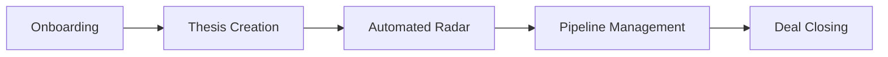
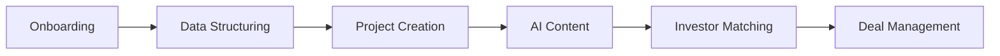
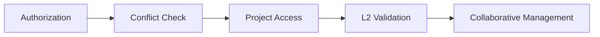

# 📊 Análise e Levantamento de Requisitos
## Mary Platform - Plataforma Inteligente de Ecossistema M&A

---

## 📌 Informações do Documento

| Campo | Valor |
|-------|-------|
| **Produto** | Mary Platform |
| **Versão** | MVP v1.0 |
| **Data de Criação** | Dezembro 2025 |
| **Baseado em** | PRD v1.2 (0-PRD.md) |
| **Status** | Em Análise |
| **Autor** | Equipe de Desenvolvimento |

---

## 1. Sumário Executivo

### 1.1 Visão do Produto

A **Mary Platform** é uma plataforma inteligente de ecossistema M&A (Fusões e Aquisições) que visa revolucionar o mercado brasileiro de investimentos e transações corporativas. A plataforma funciona como um hub unificado conectando:

- **Investidores** (PE, VC, Family Offices, Corporates, Angels, CVC, etc.)
- **Empresas/Ativos** (empresas em processos de venda, captação ou fusões)
- **Advisors** (bancos de investimento, consultorias M&A, boutiques)
- **Agentes** (profissionais que monetizam redes de contatos) - *planejado para v1.5*

### 1.2 Proposta de Valor Central

> **"Dados Vivos, Automáticos, Estruturados e Confiáveis"**

A plataforma resolve os seguintes problemas críticos do mercado:

| Problema | Solução Mary |
|----------|-------------|
| Networking informal para busca de oportunidades | Matching automatizado baseado em teses |
| Dados desorganizados em planilhas | Dados estruturados via Mary Taxonomy |
| Triagem subjetiva | Algoritmo de matching com score explicável |
| Negociação lenta | Pipeline digital com CTAs e notificações |
| Alta taxa de deals não realizados | Qualificação automatizada de ativos |

---

## 1.3 Arquitetura Consolidada (Discovery Phase)

Com base na Fase 1 do planejamento, a arquitetura alvo foi consolidada conforme abaixo:

### 1.3.1 Domínios e Bound Contexts
- **Auth**: Autenticação segura com MFA obrigatório via WhatsApp.
- **Org & RBAC**: Estrutura multi-organização e multi-perfil com permissões granulares.
- **Projects**: Gestão de ativos, projetos de venda/captação e hub de projetos.
- **VDR (Virtual Data Room)**: Repositório seguro baseado em links rastreáveis e auditados.
- **Matching Engine**: Algoritmo proprietário baseado em Mary Taxonomy (MAICS).
- **Mary AI**: Sistema de IA com contextos público e privado (RAG).
- **Billing**: Gestão de assinaturas e pagamentos via Stripe.

### 1.3.2 Padrões Técnicos e Decisões
- **Estrutura**: Monorepo gerenciado com foco em produtividade.
- **Frontend**: Next.js + Tailwind CSS + shadcn/ui (Flat Design).
- **Backend**: Supabase (PostgreSQL + RLS + Edge Functions).
- **Eventos e Auditoria**: Registro obrigatório de ações críticas via `audit_logs`
- **Feature Flags**: Controle granular de funcionalidades em tempo real.
- **Integrações**: WhatsApp (Meta API), E-mail (Brevo), Storage (Supabase/S3).

---

## 2. Requisitos Funcionais Detalhados

### 2.1 Módulo de Autenticação e Segurança

#### RF-AUTH-001: Multi-Factor Authentication (MFA)

| ID | Requisito | Prioridade | Complexidade |
|----|-----------|------------|--------------|
| RF-AUTH-001.1 | Implementar MFA obrigatório via WhatsApp Business API | Alta | Alta |
| RF-AUTH-001.2 | MFA deve ser obrigatório para todos os perfis | Alta | Média |
| RF-AUTH-001.3 | Não oferecer alternativas ao WhatsApp no MVP | Alta | Baixa |

**Critérios de Aceite:**
- [ ] Usuário recebe código de verificação via WhatsApp
- [ ] Código expira em 5 minutos
- [ ] Máximo de 3 tentativas por código
- [ ] Log de todas as tentativas de autenticação

#### RF-AUTH-002: Gestão de Sessões

| ID | Requisito | Prioridade | Complexidade |
|----|-----------|------------|--------------|
| RF-AUTH-002.1 | Sessão expira em 24 horas | Alta | Baixa |
| RF-AUTH-002.2 | Bloquear sessões simultâneas | Alta | Média |
| RF-AUTH-002.3 | Implementar refresh token | Alta | Média |
| RF-AUTH-002.4 | Não permitir visualização de sessões ativas | Média | Baixa |

**Critérios de Aceite:**
- [ ] Token JWT com expiração de 24h
- [ ] Refresh token com rotação automática
- [ ] Invalidação de sessão anterior ao novo login
- [ ] Logout automático após expiração

#### RF-AUTH-003: Recuperação de Conta

| ID | Requisito | Prioridade | Complexidade |
|----|-----------|------------|--------------|
| RF-AUTH-003.1 | Recuperação apenas via e-mail | Alta | Baixa |
| RF-AUTH-003.2 | Link de recuperação expira em 15 minutos | Alta | Baixa |
| RF-AUTH-003.3 | Limite de 3 tentativas por hora | Alta | Média |

**Critérios de Aceite:**
- [ ] E-mail enviado em até 30 segundos
- [ ] Link único com token criptografado
- [ ] Rate limiting por IP e por e-mail
- [ ] Log de tentativas de recuperação

#### RF-AUTH-004: Segurança Adicional

| ID | Requisito | Prioridade | Complexidade |
|----|-----------|------------|--------------|
| RF-AUTH-004.1 | Notificação de novo dispositivo | Média | Média |
| RF-AUTH-004.2 | Detecção de login de país diferente | Média | Alta |
| RF-AUTH-004.3 | Bloqueio por tentativas NÃO implementar no MVP | Baixa | - |

**Critérios de Aceite:**
- [ ] Alerta via WhatsApp/e-mail para novo dispositivo
- [ ] Identificação de IP e geolocalização
- [ ] Armazenamento de device fingerprint

---

### 2.2 Módulo Mary AI

#### RF-AI-001: Configuração do LLM

| ID | Requisito | Prioridade | Complexidade |
|----|-----------|------------|--------------|
| RF-AI-001.1 | LLM Principal: ChatGPT (OpenAI) | Alta | Alta |
| RF-AI-001.2 | Fallback via OpenRouter (Claude, Gemini, Grok) | Média | Alta |
| RF-AI-001.3 | Implementar estratégia RAG | Alta | Muito Alta |
| RF-AI-001.4 | Sem fine-tuning no MVP | - | - |

**Critérios de Aceite:**
- [ ] Integração funcional com API OpenAI
- [ ] Sistema de fallback automático
- [ ] Documentação de prompts e contexto
- [ ] Logs de uso e custos por requisição

#### RF-AI-002: Capacidades da IA

| ID | Requisito | Prioridade | Complexidade |
|----|-----------|------------|--------------|
| RF-AI-002.1 | Responder perguntas sobre M&A | Alta | Alta |
| RF-AI-002.2 | Gerar Teaser automatizado | Alta | Muito Alta |
| RF-AI-002.3 | Gerar CIM (Confidential Info Memo) | Alta | Muito Alta |
| RF-AI-002.4 | Gerar análise de Valuation | Alta | Muito Alta |

**Critérios de Aceite:**
- [ ] Respostas contextualizadas ao projeto/workspace
- [ ] Documentos gerados seguem templates padrão
- [ ] Edição humana possível após geração
- [ ] Versionamento de documentos gerados

#### RF-AI-003: Limites e Rate Limiting

| ID | Requisito | Prioridade | Complexidade |
|----|-----------|------------|--------------|
| RF-AI-003.1 | Rate limiting: máx 10 perguntas/minuto | Alta | Média |
| RF-AI-003.2 | Limite de interações (a definir) | Média | Baixa |
| RF-AI-003.3 | Cap de custo por usuário (a definir) | Média | Média |

**Critérios de Aceite:**
- [ ] Contador de requisições por minuto
- [ ] Mensagem amigável ao atingir limite
- [ ] Dashboard de uso para admin

#### RF-AI-004: Mary AI Public vs Private

| ID | Requisito | Prioridade | Complexidade |
|----|-----------|------------|--------------|
| RF-AI-004.1 | Public: acesso a FAQ, onboarding, pricing, educação | Alta | Média |
| RF-AI-004.2 | Private: acesso a dados do projeto, VDR, pipeline | Alta | Alta |
| RF-AI-004.3 | Isolamento de contexto entre public/private | Alta | Alta |
| RF-AI-004.4 | Guardrails de segurança obrigatórios | Alta | Alta |

**Critérios de Aceite:**
- [ ] Usuário não autenticado acessa apenas Mary Public
- [ ] Mary Private nunca expõe dados de outros projetos
- [ ] Filtros de conteúdo sensível implementados
- [ ] Auditoria de todas as interações

---

### 2.3 Módulo Virtual Data Room (VDR)

#### RF-VDR-001: Estrutura e Organização

| ID | Requisito | Prioridade | Complexidade |
|----|-----------|------------|--------------|
| RF-VDR-001.1 | Estrutura de pastas padrão pré-definida | Alta | Média |
| RF-VDR-001.2 | Permitir pastas customizadas adicionais | Média | Baixa |
| RF-VDR-001.3 | Proibir exclusão de pastas padrão | Alta | Baixa |
| RF-VDR-001.4 | Templates por setor (não no MVP) | Baixa | - |

**Estrutura de Pastas Padrão Sugerida:**
```
/VDR
├── 01-Corporate
├── 02-Financial
├── 03-Legal
├── 04-Tax
├── 05-Commercial
├── 06-Operations
├── 07-HR
├── 08-IT
├── 09-Environmental
├── 10-Other
└── /Custom (pastas adicionais)
```

#### RF-VDR-002: Controle de Acesso

| ID | Requisito | Prioridade | Complexidade |
|----|-----------|------------|--------------|
| RF-VDR-002.1 | Permissão: visualizar sem baixar | Alta | Média |
| RF-VDR-002.2 | Permissão: comentar | Média | Média |
| RF-VDR-002.3 | Permissão: editar/upload (Advisors) | Alta | Média |
| RF-VDR-002.4 | Proibir/travar prints de tela | Alta | Alta |
| RF-VDR-002.5 | Links compartilháveis e rastreáveis | Alta | Média |
| RF-VDR-002.6 | Expiração de acesso ao encerrar projeto | Alta | Baixa |
| RF-VDR-002.7 | Revogação de acesso a qualquer momento | Alta | Baixa |

**Critérios de Aceite:**
- [ ] Matriz de permissões por perfil implementada
- [ ] Tentativa de print/screenshot bloqueada ou detectada
- [ ] Cada link possui UUID único para rastreamento
- [ ] Log de todas as ações no VDR

#### RF-VDR-003: Versionamento e Histórico

| ID | Requisito | Prioridade | Complexidade |
|----|-----------|------------|--------------|
| RF-VDR-003.1 | Versionamento NÃO no MVP | - | - |
| RF-VDR-003.2 | Log de visualização completo | Alta | Média |

**Critérios de Aceite:**
- [ ] Registro: quem visualizou, quando, por quanto tempo
- [ ] Relatório exportável de acessos
- [ ] Alertas de acesso incomum

#### RF-VDR-004: Armazenamento

| ID | Requisito | Prioridade | Complexidade |
|----|-----------|------------|--------------|
| RF-VDR-004.1 | Limite por conta/projeto: 50GB | Alta | Baixa |
| RF-VDR-004.2 | Limite por arquivo: 100MB | Alta | Baixa |
| RF-VDR-004.3 | Formatos: PDF, Excel, Word, imagens, vídeos, pptx, txt | Alta | Média |
| RF-VDR-004.4 | Compressão automática | Média | Média |
| RF-VDR-004.5 | MVP usa apenas links (sem upload direto) | Alta | Baixa |

**Volume Esperado:** 200-300 documentos por projeto

#### RF-VDR-005: Q&A no VDR

| ID | Requisito | Prioridade | Complexidade |
|----|-----------|------------|--------------|
| RF-VDR-005.1 | Q&A por documento | Alta | Média |
| RF-VDR-005.2 | SLA de resposta: 48h com alertas | Alta | Média |
| RF-VDR-005.3 | Perguntas confidenciais (Ativo/Advisor apenas) | Alta | Média |
| RF-VDR-005.4 | Investidores: perguntas visíveis para Ativo/Advisors | Alta | Média |

---

### 2.4 Módulo de Matching

#### RF-MATCH-001: Configuração do Algoritmo

| ID | Requisito | Prioridade | Complexidade |
|----|-----------|------------|--------------|
| RF-MATCH-001.1 | Critério: Fit setorial/modelo (40%) | Alta | Alta |
| RF-MATCH-001.2 | Critério: Tamanho/ticket (20%) | Alta | Alta |
| RF-MATCH-001.3 | Critério: Geografia (10%) | Alta | Média |
| RF-MATCH-001.4 | Critério: Objetivo vs. tese (10%) | Alta | Alta |
| RF-MATCH-001.5 | Critério: Readiness/cobertura L2+ (20%) | Alta | Alta |
| RF-MATCH-001.6 | Pesos fixos (não configuráveis) | Alta | Baixa |
| RF-MATCH-001.7 | Matching negativo (exclusões explícitas) | Média | Média |

#### RF-MATCH-002: Explicabilidade

| ID | Requisito | Prioridade | Complexidade |
|----|-----------|------------|--------------|
| RF-MATCH-002.1 | "Why it matches": Top 3 critérios | Alta | Média |
| RF-MATCH-002.2 | Score: número (0-100) + percentual | Alta | Baixa |
| RF-MATCH-002.3 | Sem explicação para "não match" | Baixa | - |

**Critérios de Aceite:**
- [ ] Usuário entende por que um match foi sugerido
- [ ] Exibição clara do score e componentes
- [ ] Interface intuitiva de visualização

#### RF-MATCH-003: Performance

| ID | Requisito | Prioridade | Complexidade |
|----|-----------|------------|--------------|
| RF-MATCH-003.1 | Recálculo em real-time | Alta | Alta |
| RF-MATCH-003.2 | Tempo após atualização: imediato | Alta | Alta |
| RF-MATCH-003.3 | Tempo de resposta: < 2 segundos | Alta | Alta |
| RF-MATCH-003.4 | Notificações de novo match | Alta | Média |

---

### 2.5 Módulo de Usuários e Permissões (RBAC)

#### RF-RBAC-001: Hierarquia de Papéis

| ID | Requisito | Prioridade | Complexidade |
|----|-----------|------------|--------------|
| RF-RBAC-001.1 | Papel: Owner (controle total) | Alta | Média |
| RF-RBAC-001.2 | Papel: Admin (gestão membros/config) | Alta | Média |
| RF-RBAC-001.3 | Papel: Member (funcionalidades operacionais) | Alta | Média |
| RF-RBAC-001.4 | Papel: Viewer (apenas visualização) | Alta | Baixa |

#### RF-RBAC-002: Multi-perfil

| ID | Requisito | Prioridade | Complexidade |
|----|-----------|------------|--------------|
| RF-RBAC-002.1 | Usuário pode ter múltiplos perfis em contas diferentes | Alta | Alta |

**Exemplo:** Mesmo usuário pode ser Investidor em uma conta e Advisor em outra.

#### RF-RBAC-003: Convites e Onboarding

| ID | Requisito | Prioridade | Complexidade |
|----|-----------|------------|--------------|
| RF-RBAC-003.1 | Herança de verificação para novos membros | Alta | Média |
| RF-RBAC-003.2 | Expiração de convites: 7 dias | Alta | Baixa |
| RF-RBAC-003.3 | Limite de convites pendentes (a definir) | Média | Baixa |

#### RF-RBAC-004: Limites por Plano

| ID | Requisito | Prioridade | Complexidade |
|----|-----------|------------|--------------|
| RF-RBAC-004.1 | Usuários por organização: ilimitados | Alta | Baixa |
| RF-RBAC-004.2 | Projetos por conta: varia por plano | Alta | Média |
| RF-RBAC-004.3 | Teses por Investidor: varia por plano | Alta | Média |

---

### 2.6 Módulo de Dados Financeiros

#### RF-FIN-001: Entrada de Dados

| ID | Requisito | Prioridade | Complexidade |
|----|-----------|------------|--------------|
| RF-FIN-001.1 | Aceitar Excel e PDF | Alta | Média |
| RF-FIN-001.2 | Templates padrão em Excel | Alta | Média |
| RF-FIN-001.3 | OCR obrigatório para PDFs | Alta | Alta |

#### RF-FIN-002: Moeda e Conversão

| ID | Requisito | Prioridade | Complexidade |
|----|-----------|------------|--------------|
| RF-FIN-002.1 | Moeda padrão: USD | Alta | Baixa |
| RF-FIN-002.2 | Conversão automática via API | Alta | Média |
| RF-FIN-002.3 | Usuário pode escolher moeda de exibição | Média | Média |

#### RF-FIN-003: Histórico e Projeções

| ID | Requisito | Prioridade | Complexidade |
|----|-----------|------------|--------------|
| RF-FIN-003.1 | Histórico: 3-5 anos | Alta | Baixa |
| RF-FIN-003.2 | Opção "N.D." para anos sem dados | Alta | Baixa |
| RF-FIN-003.3 | Projeções: até 5 anos | Alta | Média |
| RF-FIN-003.4 | Validação: Ativo = Passivo + PL | Alta | Média |

---

### 2.7 Módulo de Perfis

#### RF-PERF-001: Área do Investidor

| ID | Requisito | Prioridade | Complexidade |
|----|-----------|------------|--------------|
| RF-PERF-001.1 | Dashboard Principal | Alta | Alta |
| RF-PERF-001.2 | Gestão de Teses de Investimento | Alta | Alta |
| RF-PERF-001.3 | Radar de Oportunidades (matching) | Alta | Muito Alta |
| RF-PERF-001.4 | Pipeline de projetos | Alta | Alta |
| RF-PERF-001.5 | Mary AI Private | Alta | Alta |
| RF-PERF-001.6 | Perfil e Configurações | Alta | Média |

**Perfis suportados:** PE, VC, Family Offices, Corporate, Angels, CVC, Venture Builder, Sovereigns, Pension Funds, Search Funds, Aceleradoras, Incubadoras.

**Etapas do Pipeline:**
```
Teaser → NDA → Pré-DD → IoI → Management Meetings → NBO → DD/SPA → Signing → CP's → Closing → Disclosure → Declinado
```

#### RF-PERF-002: Área da Empresa/Ativo

| ID | Requisito | Prioridade | Complexidade |
|----|-----------|------------|--------------|
| RF-PERF-002.1 | Dashboard Empresa | Alta | Alta |
| RF-PERF-002.2 | Virtual Data Room Institucional | Alta | Muito Alta |
| RF-PERF-002.3 | Demonstrações Financeiras (IA padroniza) | Alta | Alta |
| RF-PERF-002.4 | Gestão de Cap Table | Alta | Alta |
| RF-PERF-002.5 | Gestão de KPIs | Alta | Média |
| RF-PERF-002.6 | Mary Readiness Score® | Alta | Alta |
| RF-PERF-002.7 | Hub de Projetos | Alta | Alta |
| RF-PERF-002.8 | Geração de Teaser (IA) | Alta | Muito Alta |
| RF-PERF-002.9 | Valuation (múltiplos automáticos) | Alta | Muito Alta |
| RF-PERF-002.10 | CIM (Confidential Info Memo) | Alta | Alta |
| RF-PERF-002.11 | Lista de Investidores (matching reverso) | Alta | Alta |
| RF-PERF-002.12 | VDR por Investidor (isolado) | Alta | Alta |
| RF-PERF-002.13 | Pipeline do Projeto | Alta | Alta |

#### RF-PERF-003: Área do Advisor

| ID | Requisito | Prioridade | Complexidade |
|----|-----------|------------|--------------|
| RF-PERF-003.1 | Dashboard Advisor | Alta | Média |
| RF-PERF-003.2 | Lista de Projetos (visualização contextual) | Alta | Alta |
| RF-PERF-003.3 | Mary AI Private | Alta | Alta |
| RF-PERF-003.4 | Perfil e Configurações | Alta | Média |
| RF-PERF-003.5 | Regra de conflito: sell-side OU buy-side, nunca ambos | Alta | Alta |

#### RF-PERF-004: Mary Admin

| ID | Requisito | Prioridade | Complexidade |
|----|-----------|------------|--------------|
| RF-PERF-004.1 | Dashboard Interno | Alta | Média |
| RF-PERF-004.2 | Gestão de tickets | Alta | Média |
| RF-PERF-004.3 | Lista de usuários | Alta | Média |
| RF-PERF-004.4 | Monitoramento Mary AI Public | Alta | Média |
| RF-PERF-004.5 | Monitoramento Mary AI Private | Alta | Média |

---

### 2.8 Módulo de Pagamentos

#### RF-PAG-001: Gateway e Métodos

| ID | Requisito | Prioridade | Complexidade |
|----|-----------|------------|--------------|
| RF-PAG-001.1 | Gateway: Stripe | Alta | Alta |
| RF-PAG-001.2 | Suporte a assinaturas recorrentes | Alta | Alta |
| RF-PAG-001.3 | Método: Cartão de crédito | Alta | Média |
| RF-PAG-001.4 | Desconto anual (% a definir) | Média | Baixa |
| RF-PAG-001.5 | Cobrança por conta/organização | Alta | Média |
| RF-PAG-001.6 | Nota Fiscal NÃO automática no MVP | - | - |

#### RF-PAG-002: Success Fee

| ID | Requisito | Prioridade | Complexidade |
|----|-----------|------------|--------------|
| RF-PAG-002.1 | Percentual variável por tipo de transação | Alta | Média |
| RF-PAG-002.2 | Cobrado do Ativo (sell-side) | Alta | Baixa |
| RF-PAG-002.3 | Rastreamento via Pipeline + Closing | Alta | Alta |
| RF-PAG-002.4 | Split com Advisors/Agentes NÃO no MVP | - | - |

---

### 2.9 Módulo de Notificações

#### RF-NOT-001: Canais de Comunicação

| ID | Requisito | Prioridade | Complexidade |
|----|-----------|------------|--------------|
| RF-NOT-001.1 | WhatsApp via API oficial | Alta | Alta |
| RF-NOT-001.2 | E-mail transacional via Brevo | Alta | Média |
| RF-NOT-001.3 | Templates WhatsApp (a definir) | Alta | Média |
| RF-NOT-001.4 | Calendário NÃO no MVP | - | - |

---

## 3. Requisitos Não-Funcionais

### 3.1 Performance e Escalabilidade

#### RNF-PERF-001: Métricas de Performance

| ID | Requisito | Valor | Prioridade |
|----|-----------|-------|------------|
| RNF-PERF-001.1 | Uptime | 99% | Alta |
| RNF-PERF-001.2 | Tempo resposta Matching | < 2 segundos | Alta |
| RNF-PERF-001.3 | Tempo resposta Mary AI | < 5 segundos | Alta |

#### RNF-PERF-002: Projeções de Uso (MVP)

| Métrica | Valor Esperado |
|---------|----------------|
| Usuários | ~100 |
| Deals simultâneos | ~50 |
| Documentos por projeto | 200-300 (links) |

#### RNF-PERF-003: Infraestrutura

| ID | Requisito | Especificação | Prioridade |
|----|-----------|---------------|------------|
| RNF-PERF-003.1 | Região | Brasil | Alta |
| RNF-PERF-003.2 | CDN | Sim | Alta |
| RNF-PERF-003.3 | Ambiente staging | Sim (separado) | Alta |

---

### 3.2 Interface e UX

#### RNF-UX-001: Plataformas

| ID | Requisito | Especificação | Prioridade |
|----|-----------|---------------|------------|
| RNF-UX-001.1 | Abordagem | Mobile-first, Responsive | Alta |
| RNF-UX-001.2 | Dashboard mobile | Versão simplificada | Média |
| RNF-UX-001.3 | Navegadores suportados | Chrome, Safari, Opera, Firefox, Edge (versões modernas) | Alta |

#### RNF-UX-002: Internacionalização (i18n)

| ID | Requisito | Especificação | Prioridade |
|----|-----------|---------------|------------|
| RNF-UX-002.1 | Rotas | 100% EN-US | Alta |
| RNF-UX-002.2 | Conteúdo principal | PT-BR | Alta |
| RNF-UX-002.3 | Interface admin | Apenas PT-BR | Alta |
| RNF-UX-002.4 | Idiomas i18n | PT, EN, ES, FR | Média |
| RNF-UX-002.5 | Idiomas futuros | Alemão, Japonês, Mandarim | Baixa |

#### RNF-UX-003: Design

| ID | Requisito | Especificação | Prioridade |
|----|-----------|---------------|------------|
| RNF-UX-003.1 | Dark mode | Não | - |
| RNF-UX-003.2 | Brand book | Já definido | Alta |
| RNF-UX-003.3 | White-label | Não | - |

#### RNF-UX-004: Acessibilidade

| ID | Requisito | Especificação | Prioridade |
|----|-----------|---------------|------------|
| RNF-UX-004.1 | Nível WCAG | AA | Alta |
| RNF-UX-004.2 | Suporte a leitores de tela | Sim | Alta |

---

### 3.3 Compliance e LGPD

#### RNF-LGPD-001: Retenção de Dados

| Tipo de Dado | Período | Status |
|--------------|---------|--------|
| Após inatividade | A definir | ⚠️ Pendente |
| Deals fechados | Indefinido (com paywall) | ✅ Definido |
| Deals declinados | A definir | ⚠️ Pendente |

#### RNF-LGPD-002: Direitos do Titular

| ID | Requisito | Especificação | Prioridade |
|----|-----------|---------------|------------|
| RNF-LGPD-002.1 | Portabilidade | Sim (detalhes a definir) | Alta |
| RNF-LGPD-002.2 | Prazo para exclusão | Até 5 dias úteis | Alta |
| RNF-LGPD-002.3 | Exclusão com deals em andamento | Conforme Termos de Uso seção 14 | Alta |

#### RNF-LGPD-003: Auditoria e Logs

| ID | Requisito | Especificação | Prioridade |
|----|-----------|---------------|------------|
| RNF-LGPD-003.1 | Retenção de logs | Tempo indeterminado | Alta |
| RNF-LGPD-003.2 | Relatório exportável | Sim | Alta |

#### RNF-LGPD-004: Termos e Consentimentos

| ID | Requisito | Especificação | Prioridade |
|----|-----------|---------------|------------|
| RNF-LGPD-004.1 | Termos de Uso | Já redigidos | ✅ |
| RNF-LGPD-004.2 | Política de Privacidade | Já redigida | ✅ |
| RNF-LGPD-004.3 | Versionamento com re-aceite | Sim | Alta |
| RNF-LGPD-004.4 | Consentimentos | Único (não granular) | Alta |

---

## 4. Modelo de Dados - Mary Taxonomy (MAICS)

### 4.1 Sistema de Classificação Setorial

**MAICS (Mary Industry Classification Standard)** é o sistema proprietário de classificação setorial.

#### Estrutura Hierárquica

| Nível | Descrição |
|-------|-----------|
| Level 1 | Macrosetor (12 categorias) |
| Level 2 | Setor |
| Level 3 | Subsetor |

**Equivalências:** `naics_codes[]`, `cnae_codes[]`

#### Os 12 Macrosetores

| Código | Macrosetor |
|--------|------------|
| 01 | 🏦 Financial & Professional Services |
| 02 | 💻 Technology & Digital Infrastructure |
| 03 | 🌿 Energy, Utilities & Sustainability |
| 04 | 🏭 Industrial, Manufacturing & Engineering |
| 05 | 🚚 Logistics, Supply Chain & Mobility |
| 06 | 🏪 Retail, Consumer & E-Commerce |
| 07 | 🏥 Healthcare, Pharma & Life Sciences |
| 08 | 🏫 Education, Training & Human Capital |
| 09 | 🏘️ Real Estate, Construction & Infrastructure |
| 10 | 📡 Media, Telecom & Entertainment |
| 11 | 🌱 Agriculture, Food & Agritech |
| 12 | 🎯 Public, Nonprofit & Impact |

### 4.2 Modelo de Validação L1/L2/L3

#### Níveis de Validação

| Nível | Quem Executa | O que Valida | Confiança | Peso |
|-------|--------------|--------------|-----------|------|
| **L1 – Origem** | Empresa/Sócios | Dados originais (autodeclaração) | Baixa / "Raw" | 0.3 |
| **L2 – Revisão** | Advisor/Analista | Coerência, formatação, completude | Média / "Curated" | 0.7 |
| **L3 – Auditoria** | Auditor/Compliance | Checagem formal documental | Alta / "Verified" | 1.0 |

#### Rastreabilidade de Dados

Cada dado possui metadados:
- `submitted_by` - Quem submeteu
- `validated_by` - Quem validou (L2)
- `audited_by` - Quem auditou (L3)
- `hash_original` - Hash do dado original
- `hash_reviewed` - Hash após revisão
- `timestamp` - Data/hora de cada ação

#### Impacto nas Análises

| Aspecto | Regra |
|---------|-------|
| Matching | Ativos com ≥70% dados L2+ ganham prioridade |
| Filtros | "Exibir apenas dados L2+" ou "Somente L3 verificados" |
| Alertas | IA emite alertas de gaps em níveis de validação |

---

## 5. Gate de Elegibilidade

### 5.1 Critérios Mínimos

| Critério | Investidor Individual | Advisor |
|----------|----------------------|---------|
| Deals (últimos 3 anos) | ≥ 2 | ≥ 2 |
| Experiência em M&A | ≥ 5 anos | ≥ 5 anos |
| Valor acumulado mínimo | ≥ USD 20k | ≥ USD 100k |

### 5.2 Estados de Verificação

| Status | Acesso |
|--------|--------|
| `pending` | Onboarding completo, modo leitura-only |
| `verified` + `completed` | Acesso total ao dashboard |
| `rejected` | Modo "observador/candidate" + appeal |

### 5.3 Verificação Híbrida

1. **Automática (score):** Análise de deals, URLs, reputação de domínio
2. **Manual (amostragem):** SLA 48h para casos com score médio/baixo

---

## 6. Stack Tecnológica

### 6.1 Backend e Banco de Dados

| Tecnologia | Especificação |
|------------|---------------|
| Backend | Supabase |
| Banco de Dados | PostgreSQL (Supabase) |
| Serverless | Edge Functions |

### 6.2 Frontend

| Tecnologia | Especificação |
|------------|---------------|
| Framework | Next.js |
| Linguagem | TypeScript |

### 6.3 DevOps e CI/CD

| Ferramenta | Especificação |
|------------|---------------|
| Versionamento | GitHub |
| CI/CD | Vercel (plano pago) |
| Deploy automático | Sim (staging e produção) |

### 6.4 Monitoramento

| Ferramenta | Especificação |
|------------|---------------|
| Erros | A definir (Sentry sugerido) |
| Analytics | Vercel Analytics (+ GA se necessário) |
| Alertas críticos | Sim |

### 6.5 Integrações Externas

| Integração | Provider/Status |
|------------|-----------------|
| WhatsApp | API oficial |
| E-mail transacional | Brevo ou similar |
| Enriquecimento de dados | jina.ai |
| Pagamentos | Stripe |
| LLM Principal | OpenAI (ChatGPT) |
| LLM Fallback | OpenRouter (Claude, Gemini, Grok) |

---

## 7. Jornadas de Usuário

### 7.1 Journey Investidor → Deal Flow Qualificado



**Detalhamento:**
1. **Onboarding:** Cadastro, verificação MFA, gate de elegibilidade
2. **Thesis Creation:** Definição de teses de investimento
3. **Automated Radar:** Recebimento de matches automatizados
4. **Pipeline Management:** Gestão do pipeline de deals
5. **Deal Closing:** Conclusão da transação

### 7.2 Journey Ativo → Exposição Qualificada



**Detalhamento:**
1. **Onboarding:** Cadastro e verificação
2. **Data Structuring:** Estruturação de dados via Mary Taxonomy
3. **Project Creation:** Criação do projeto de venda/captação
4. **AI Content:** Geração de Teaser, CIM, Valuation via IA
5. **Investor Matching:** Recebimento de matches com investidores
6. **Deal Management:** Gestão da negociação

### 7.3 Journey Advisor → Curadoria L2



**Detalhamento:**
1. **Authorization:** Autorização e vinculação ao projeto
2. **Conflict Check:** Verificação de conflitos de interesse
3. **Project Access:** Acesso contextual ao projeto
4. **L2 Validation:** Validação e curadoria dos dados
5. **Collaborative Management:** Gestão colaborativa do deal

---

## 8. Métricas de Sucesso

### 8.1 Métricas do Investidor

| Métrica | Meta |
|---------|------|
| Time to first qualified lead | < 7 dias |
| Match accuracy | > 70% teasers → NDA |
| Pipeline velocity | 4x faster vs. tradicional |

### 8.2 Métricas do Ativo

| Métrica | Meta |
|---------|------|
| Setup to first interest | < 14 dias |
| Readiness improvement | 80% melhoram MRS em 30 dias |
| Qualified interest rate | > 60% teaser → NDA |

### 8.3 Métricas do Advisor

| Métrica | Meta |
|---------|------|
| Operational efficiency | 50% redução tarefas admin |
| Data quality | 90% L2 validation em 30 dias |
| Deal velocity | 3x faster closure |

---

## 9. Escopo MVP v1.0

### 9.1 ✅ Incluído no MVP

| Perfil | Funcionalidades |
|--------|-----------------|
| **Investidor** | Thesis → Matching → Pipeline → VDR |
| **Ativo** | Setup → Projeto → Teaser → Negociação |
| **Advisor** | Acesso contextual limitado (sell-side OU buy-side) |

### 9.2 ❌ Excluído do MVP (Versões Futuras)

| Funcionalidade | Versão Planejada |
|----------------|------------------|
| Agente | v1.5 |
| Tasks, Inbox, Documents, Signatures | TBD |
| Banking/Open Banking | Futuro |
| Smart contracts, PMI, BI | Futuro |
| Marketplace, Rankings, Deals Club | Futuro |
| Versionamento de documentos | v2 |
| Marca d'água dinâmica | v2 |
| Dark mode | Futuro |
| White-label | Futuro |
| Integração calendário | v2 |
| Assinatura digital nativa | v2 |

---

## 10. Riscos e Dependências

### 10.1 Riscos Técnicos

| Risco | Probabilidade | Impacto | Mitigação |
|-------|---------------|---------|-----------|
| Complexidade do algoritmo de matching | Alta | Alto | Prototipagem iterativa, testes A/B |
| Custos com LLM podem escalar | Média | Médio | Limites de uso, monitoramento de custos |
| Performance do RAG com grande volume | Média | Alto | Otimização de índices, cache |
| Integração WhatsApp API | Baixa | Alto | Plano de contingência com SMS |

### 10.2 Riscos de Negócio

| Risco | Probabilidade | Impacto | Mitigação |
|-------|---------------|---------|-----------|
| Adoção lenta por investidores | Média | Alto | Base pré-cadastrada, beta fechado |
| Qualidade dos dados iniciais | Alta | Médio | Validação L1/L2/L3 rigorosa |
| Compliance LGPD | Baixa | Alto | Consultoria jurídica, DPO |

### 10.3 Dependências Externas

| Dependência | Criticidade | Alternativa |
|-------------|-------------|-------------|
| OpenAI API | Alta | OpenRouter (Claude, Gemini) |
| Stripe | Alta | Nenhuma definida |
| WhatsApp Business API | Alta | SMS como fallback |
| Supabase | Alta | Migração para PostgreSQL dedicado |
| Vercel | Média | AWS/GCP |

---

## 11. Questões Pendentes

As seguintes questões precisam de definição antes do desenvolvimento:

### 11.1 Mary AI
- [ ] Período de armazenamento de conversas
- [ ] Escopo de execução de ações na plataforma

### 11.2 Matching
- [ ] Critérios obrigatórios (deal breakers)

### 11.3 Usuários
- [ ] Limite de convites pendentes

### 11.4 Dados Financeiros
- [ ] Anos de histórico necessários (mínimo)
- [ ] Taxa de conversão específica (API a usar)

### 11.5 LGPD
- [ ] Período de retenção após inatividade
- [ ] Período de retenção de deals fechados/declinados
- [ ] Detalhes de portabilidade de dados

### 11.6 VDR
- [ ] Definição completa de perguntas confidenciais

### 11.7 Internacionalização
- [ ] Idiomas suportados no MVP (quantos?)
- [ ] Idioma dos documentos gerados por IA

### 11.8 Infraestrutura
- [ ] Ferramenta de monitoramento de erros (Sentry?)

### 11.9 Beta
- [ ] Usuários específicos para beta
- [ ] Duração e critérios de avanço

---

## 12. Matriz de Rastreabilidade

### 12.1 Requisitos vs Módulos

| Módulo | Requisitos Funcionais | Requisitos Não-Funcionais |
|--------|----------------------|---------------------------|
| Autenticação | RF-AUTH-001 a RF-AUTH-004 | RNF-PERF-001 |
| Mary AI | RF-AI-001 a RF-AI-004 | RNF-PERF-001.3 |
| VDR | RF-VDR-001 a RF-VDR-005 | RNF-LGPD-003 |
| Matching | RF-MATCH-001 a RF-MATCH-003 | RNF-PERF-001.2 |
| RBAC | RF-RBAC-001 a RF-RBAC-004 | RNF-LGPD-002 |
| Financeiro | RF-FIN-001 a RF-FIN-003 | RNF-UX-002 |
| Perfis | RF-PERF-001 a RF-PERF-004 | RNF-UX-001 |
| Pagamentos | RF-PAG-001 a RF-PAG-002 | RNF-LGPD-004 |
| Notificações | RF-NOT-001 | RNF-PERF-001.1 |

### 12.2 Priorização MoSCoW

| Prioridade | Módulos |
|------------|---------|
| **Must Have** | Autenticação, VDR (básico), Matching, RBAC, Perfis (Investidor, Ativo, Advisor básico) |
| **Should Have** | Mary AI (geração docs), Financeiro (OCR), Pagamentos |
| **Could Have** | Notificações WhatsApp, Q&A VDR completo |
| **Won't Have (MVP)** | Agente, Versionamento docs, Assinatura digital, Dark mode |

---

## 13. Próximos Passos

### Fase 1: Especificação Detalhada
- [ ] Database Schema com Supabase
- [ ] Mary Taxonomy completa (setores L2 e L3)
- [ ] Detalhamento do Algoritmo de Matching
- [ ] Matriz RBAC detalhada (permissões granulares)
- [ ] Definição de templates de documentos

### Fase 2: Design e Protótipo
- [ ] Wireframes de onboarding flows
- [ ] Wireframes de dashboards principais
- [ ] Wireframes de pipeline interfaces
- [ ] Wireframes de VDR
- [ ] Revisão de UX com stakeholders

### Fase 3: Arquitetura Técnica
- [ ] Definição de arquitetura de microsserviços/monolito
- [ ] Especificação de APIs
- [ ] Estratégia de cache e performance
- [ ] Plano de segurança e criptografia

### Fase 4: Integração Mary AI
- [ ] Isolamento de contexto
- [ ] Implementação RAG
- [ ] Guardrails de segurança
- [ ] Testes de geração de documentos

### Fase 5: Beta
- [ ] Seleção de usuários beta
- [ ] Definição de critérios de sucesso
- [ ] Plano de coleta de feedback

---

## 14. Histórico de Revisões

| Versão | Data | Autor | Descrição |
|--------|------|-------|-----------|
| 1.0 | Dez/2025 | Equipe de Desenvolvimento | Documento inicial de análise de requisitos |

---

*Última atualização: 26/12/2025*
*Versão do Documento: 1.0*
*Baseado em: PRD v1.2 (0-PRD.md)*

